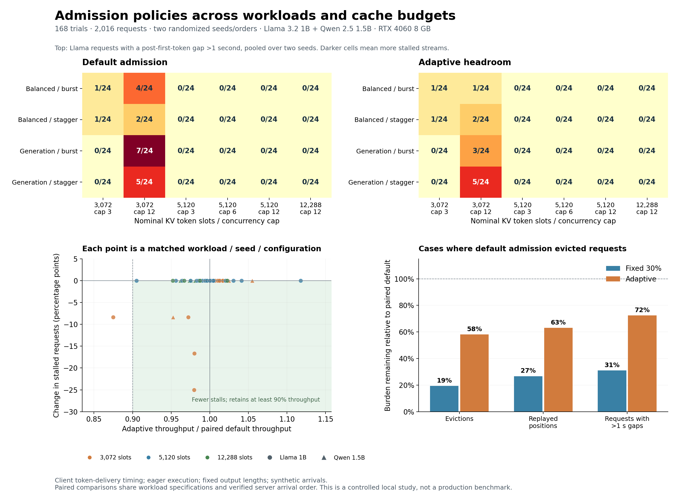
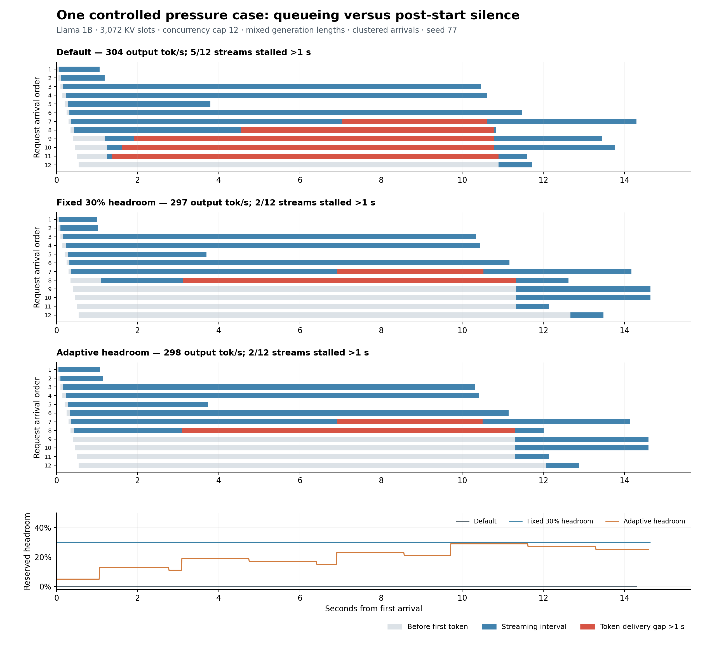

# Admission pressure across mixed workloads

Completed controlled local GPU study: **168 retained evaluation trials, 2,016 requests**, with all token counts, arrival orders, eviction counters, replay accounting, and policy states verified. Setup diagnostics and early uncontrolled simultaneous-arrival batches are excluded. Evaluation parameters were frozen before the retained runs. One entire 12-trial configuration was replaced after an engine arrival-order violation; the excluded run is preserved, and the repeat uses unchanged code, workload, settings, warmups, and policy order. The first repeat passing the order check is retained. Its placement at the end differs from the prospective configuration order; this is documented in order_replacement.json.

## What the experiment establishes

Admission pressure remains relevant when prompt lengths, output lengths, arrivals, cache capacity, concurrency, model architecture, and random orders vary. The throughput-versus-streaming tradeoff is conditional: it appears under pressure, and relaxes when sufficient cache capacity or lower concurrency prevents eviction. It is not present in every sampled workload.

Across the 24 available paired larger-cap versus cap-3 comparisons, **7** had both more than 3% higher throughput and more streams with a post-first-token gap over one second. This is a descriptive filter, not a significance test. The low-cap baseline controls had 2 evictions and 2 stalled requests across 16 trials. The 12,288-slot baseline controls had 0 evictions and 0 stalled requests across 12 trials; their worst gap was 0.140 seconds.

| KV slots | Higher cap | Paired workloads/seeds | Throughput gain + more stalls |
| --- | --- | --- | --- |
| 3072 | 12 | 8 | 7 |
| 5120 | 6 | 8 | 0 |
| 5120 | 12 | 8 | 0 |

The adaptive controller reduced eviction/replay burden, but its pause reduction must be judged separately. In the **16 workloads where default admission evicted requests**, it retained 99.4% of paired baseline throughput. Stalled requests changed from 29 to 21; evictions from 62 to 36; replayed positions from 31,417 to 19,834. It improved the number of stalled streams in 5 cases and worsened it in 0; 4 cases improved while retaining at least 90% throughput. The constant-reserve policy provides a useful conservative comparator.

## Policy comparison under pressure

| Policy | Throughput retained* | Requests with >1 s gaps | Evictions | Replayed positions | Excess silence, seconds | Worst gap, seconds | Median TTFT ratio* | p95 completion ratio* |
| --- | --- | --- | --- | --- | --- | --- | --- | --- |
| Default | 100% | 29 | 62 | 31,417 | 100.64 | 9.54 | 1.00 | 1.00 |
| Fixed 30% headroom | 90.9% | 9 | 12 | 8,399 | 44.28 | 10.26 | 1.99 | 1.13 |
| Adaptive headroom | 99.4% | 21 | 36 | 19,834 | 72.91 | 10.17 | 1.04 | 1.01 |

*Throughput and latency ratios are geometric means of paired, per-trial ratios. Counts and excess silence are summed across the same baseline-pressure cases; each policy has 192 requests in this subset. TTFT is client first-token delay. Completion p95 is calculated among the twelve requests in each trial. Excess silence sums the portion above one second for every inter-delivery gap after the first token. Counts can improve even if the single worst pause increases.*

Across **all 56 matched workloads**, adaptive retained 99.5% throughput and fixed headroom retained 96.1%. Across all cases, default had 29 stalled requests, adaptive had 21, and fixed headroom had 9. Adaptive improved the number of stalled streams in 5 cases and worsened it in 0. Averaging in many pressure-free controls can conceal the behavior of interest, which is why pressure cases are reported separately. All-case totals also include any failures that a policy introduces when the baseline was smooth.

Keeping 90% of total throughput is different from keeping 90% of the gain from batching. Where default admission beat cap 3 by more than 5%, the adaptive policy retained a median **100.0% of that incremental gain** across 22 comparisons. This fraction is `(adaptive - cap3) / (default high-cap - cap3)` and can exceed 100% or be negative. For those comparisons that also had default post-start stalls, the median is 94.3% across 7 comparisons. Among these 7 initially stalled comparisons with a measurable batching gain, adaptive reduced the number of stalled streams and kept at least half of that incremental gain in 4. The 5% denominator filter is descriptive, not statistical.

## Where the pattern appeared

| Default-admission slice | Trials | Trials with eviction | Trials with >1 s gaps | Stalled requests / requests | Worst gap, seconds |
| --- | --- | --- | --- | --- | --- |
| model=llama1b | 48 | 12 | 9 | 20 / 576 | 9.54 |
| model=qwen1.5b | 8 | 4 | 4 | 9 / 96 | 8.41 |
| mix=balanced | 24 | 8 | 5 | 8 / 288 | 4.08 |
| mix=generation | 32 | 8 | 8 | 21 / 384 | 9.54 |
| arrival=burst | 28 | 8 | 7 | 17 / 336 | 9.54 |
| arrival=stagger | 28 | 8 | 6 | 12 / 336 | 8.88 |
| seed=23 | 28 | 6 | 5 | 9 / 336 | 4.68 |
| seed=77 | 28 | 10 | 8 | 20 / 336 | 9.54 |

| Pressure-case slice | Pairs | Adaptive throughput retained | Default stalled requests | Adaptive stalled requests | Fixed stalled requests |
| --- | --- | --- | --- | --- | --- |
| model=llama1b | 12 | 98.9% | 20 | 13 | 4 |
| model=qwen1.5b | 4 | 101.0% | 9 | 8 | 5 |
| arrival=burst | 8 | 97.9% | 17 | 9 | 5 |
| arrival=stagger | 8 | 101.0% | 12 | 12 | 4 |
| seed=23 | 6 | 97.1% | 9 | 6 | 0 |
| seed=77 | 10 | 100.9% | 20 | 15 | 9 |

These are overlapping slices, not independent samples. Both seeds randomize request pairings, server-configuration order, and policy order. The secondary model differs in architecture as well as parameter count; its two sampled configurations are an architecture check, not an isolated model-size experiment.

| Gap threshold | Default stalled requests | Fixed stalled requests | Adaptive stalled requests |
| --- | --- | --- | --- |
| 0.5 s | 38 | 11 | 26 |
| 1 s | 29 | 9 | 21 |
| 2 s | 22 | 8 | 17 |
| 5 s | 8 | 4 | 7 |

The threshold sensitivity table uses exactly the baseline-pressure subset at each threshold. It does not choose or drop cases based on the adaptive result. Default stalled requests in trials without an eviction: **0**. Of 29 default requests stalled beyond one second, 29 were themselves evicted at some point. An engine eviction can precede delivery of an already in-flight first token; client delivery and scheduler events are not perfectly aligned.

## Concrete cases and the controller's limitation

**llama1b, 3,072 slots, cap 12, generation mix, burst, seed 77**

| Policy | Output tok/s | Stalled streams / 12 | Worst gap, s | Evictions | Replay positions | Longest eviction-to-resume wait, s |
| --- | --- | --- | --- | --- | --- | --- |
| baseline | 304.4 | 5 | 9.537 | 8 | 4357 | 9.493 |
| fixed | 297.3 | 2 | 8.199 | 3 | 2132 | 8.056 |
| adaptive | 298.2 | 2 | 8.211 | 4 | 2737 | 8.067 |

This burst case was selected for the timeline before observing the retained evaluation outcomes.

**llama1b, 3,072 slots, cap 12, generation mix, stagger, seed 23**

| Policy | Output tok/s | Stalled streams / 12 | Worst gap, s | Evictions | Replay positions | Longest eviction-to-resume wait, s |
| --- | --- | --- | --- | --- | --- | --- |
| baseline | 202.0 | 2 | 2.722 | 3 | 1168 | 2.627 |
| fixed | 183.5 | 0 | 0.118 | 0 | 0 | 0.000 |
| adaptive | 202.6 | 2 | 3.553 | 2 | 880 | 3.531 |

The staggered seed-23 case is a counterexample to assuming that fewer evictions guarantee shorter pauses. Adaptive admission replayed fewer positions, but the worst stream waited longer to resume. The trace shows the victim's wait until its first rescheduled prefill grew from about 2.63 to 3.53 seconds. Native watermark reservation applies when admitting both fresh and preempted waiting requests; increasing it can delay the victim too. Also, the feedback reacts after an eviction and starts fresh in every trial, so it cannot prevent all initial pressure events.

**qwen1.5b, 3,072 slots, cap 6, generation mix, burst, seed 77**

| Policy | Output tok/s | Stalled streams / 12 | Worst gap, s | Evictions | Replay positions | Longest eviction-to-resume wait, s |
| --- | --- | --- | --- | --- | --- | --- |
| baseline | 211.5 | 3 | 8.168 | 5 | 2992 | 7.760 |
| fixed | 214.7 | 3 | 10.257 | 3 | 2101 | 9.977 |
| adaptive | 223.0 | 3 | 8.803 | 4 | 2850 | 8.609 |

The Qwen seed-77 case also tests a limitation of constant reserve: full-input admission cannot predict the future KV demand of long outputs. Even reserved headroom can be exhausted after several streams begin decoding. Neither tested policy is a pause guarantee.

A next controller design could distinguish fresh admissions from resuming streams, or react to observed pause budgets before another eviction. That is an untested extension. These results evaluate one simple feedback policy and a fixed reserve, not an optimal adaptive admission policy.

## Design and measurement

- **Hardware/software:** RTX 4060 Laptop, 8,188 MiB, 55 W; local vLLM 0.30.0, Torch 2.13.0+cu132, FlashInfer 0.6.18.post1. Eager asynchronous execution; BF16 weights and KV; block size 16; max context and per-step batched tokens both 2,048; prefix caching disabled. GPU snapshots and locked evaluation source hashes are in `provenance.json`.
- **Primary:** Llama 3.2 1B, six `(nominal KV token slots, cap)` points: `(3072,3)`, `(3072,12)`, `(5120,3)`, `(5120,6)`, `(5120,12)`, `(12288,12)`. Corresponding KV allocations are 96, 160, and 384 MiB. This is a fractional six-point design, not a full cache-by-cap factorial.
- **Secondary:** Qwen 2.5 1.5B at `(3072,6)` and `(12288,12)`, using 84 and 336 MiB. Token capacity is matched, not bytes. A null block consumes 16 nominal token slots in both models.
- **Workloads:** twelve requests per trace. Balanced: inputs 128/256/512/1024 and outputs 64/128/256/512, three of each independently shuffled. Generation-heavy: inputs 128/256/512 and outputs 64/256/768, four of each independently shuffled. Exact tokenizer-ID prompts and arrival times are saved. Secondary runs use only the generation-heavy mix.
- **Arrivals/order:** clustered burst spacing 50 ms, all twelve within 0.55 seconds; staggered spacing 50 ms plus an exponential draw averaging 0.95 seconds. Seeds 23 and 77 select pairings and orders. Every paired policy shares the exact workload, and engine arrival order 0–11 is verified for every retained trial. Two short warmups per server are excluded.
- **Policies:** default watermark 0; fixed watermark 30%; adaptive starts at 5%, adds 8 percentage points per eviction, caps at 45%, and removes 2 points after 128 nonempty eviction-free scheduling steps. State resets per trial. All use the same tracing wrapper and native FCFS scheduler; no requests are dropped, cancelled, or admitted using future output lengths.
- **Streaming:** silence is the elapsed time between consecutive client token-ID delivery events after the first token. Empty decoded text does not hide delivered tokens. Output length is enforced with `ignore_eos`; emitted IDs are counted and matched to API usage. Network batching and delivery jitter remain part of the observed stream behavior.
- **Replay:** scheduler traces count previously computed token positions scheduled again after eviction. These totals exactly match lost computed positions and native eviction counters. They measure scheduled replay work, not GPU FLOPs or retired instructions. Logical prompt and generation counters do not include this extra work.

The reservation mechanism follows vLLM's native [KV admission watermark](https://github.com/vllm-project/vllm/pull/44594). Native [full-input admission](https://github.com/vllm-project/vllm/pull/37307) reserves prompt capacity, without an oracle for future output length. Congestion-based adaptation has precedent, including [CONCUR](https://arxiv.org/abs/2601.22705); this local controller is not a novelty claim.

## Limits and reproducibility

This strengthens the local phenomenon across heterogeneous traces; it does not establish universal robustness. There are only two seeds, one laptop GPU, synthetic text, forced output lengths, eager execution, six primary configuration points, and two secondary architecture points. Staggered throughput includes the arrival span and can be arrival-limited. GPU clocks were observed rather than locked, so small speed differences should be treated cautiously. The largest recorded client arrival lateness was 0.0007 seconds. Policy-induced first-token queueing and completion latency are reported so that moving waiting time before the first token is visible.

Reproduce with the lab environment activated. `run.py --prefix rerun` writes a new set of configuration folders; it refuses to overwrite existing ones. Then run `analyze_study.py --prefix rerun` and `extra_analysis.py` with the lab Python. Generate figures with the existing plotting environment, `/home/varish/miniconda3/envs/kvzip/bin/python plot_study.py` (Matplotlib 3.10.9), and generate the report with the lab Python and `make_report.py`. This report generator also records the retained study's order-replacement provenance. Copy the original analysis/report outputs first because these derived filenames are overwritten. `run.py` and `control_scheduler.py` import the preserved helpers in the sibling `capacity_cliff_20261002` experiment; their recorded source hashes are unchanged throughout evaluation. No external model download is needed for the saved local snapshots.

Raw configuration folders contain commands, model/cache settings, randomized case order, exact workloads, scheduler JSONL traces, server logs, per-request streaming events, GPU snapshots, and before/after native metrics. `trials.csv`, `requests.csv`, `paired.csv`, and `batching.csv` provide tidy exports; `checks.json` records verification; `design.json` and `DESIGN.md` describe the prospective scope. Diagnostic, early `eval*`, and `excluded_order_*` folders are retained for provenance and excluded from all reported results. `order_replacement.json` records the order failure and replacement; `order_audit.json` independently checks all retained arrival sequences. The results bundle includes the excluded order-failure configuration so the decision is auditable.
