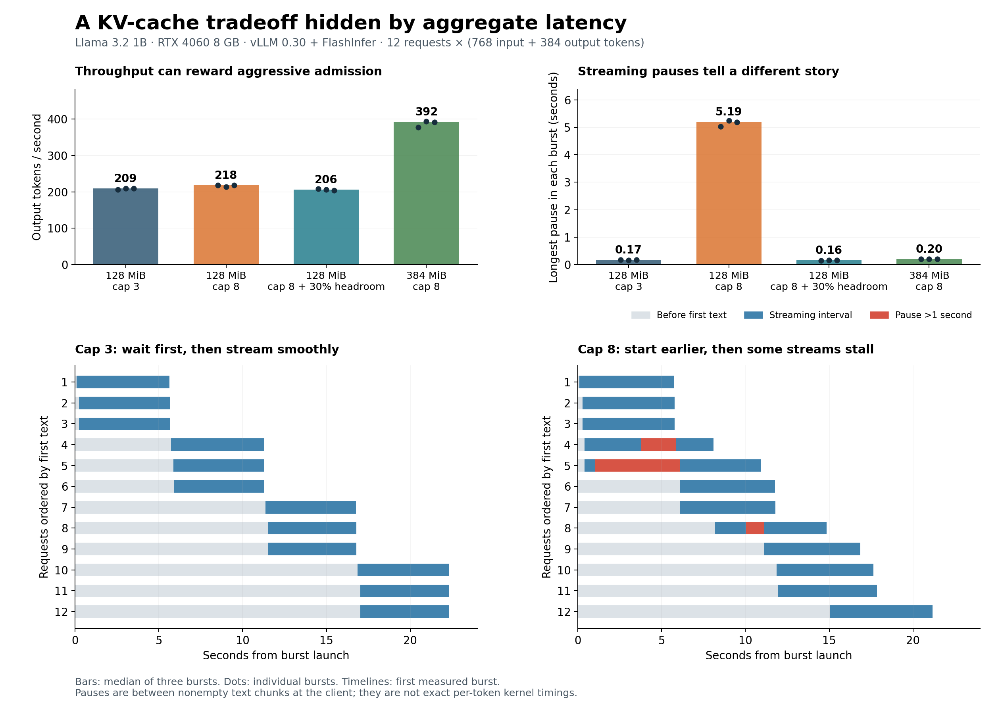

# Earlier first text, followed by five seconds of silence

Measured October 2, 2026, in `/home/varish/kv-cache-lab`. All changes are confined to this new experiment directory.

Raising the concurrency cap under a tight KV-cache budget produced better aggregate throughput, median time to first text, and completion latency, while introducing multi-second pauses in streams that had already started. The pauses reproduced in every measured burst. Reserving headroom prevented them. A second finding is that this installed version's standard prompt-token counter excludes the repeated prefill work after eviction.

## Results

Each row summarizes three measured bursts, each containing 12 simultaneously submitted requests. Each request has exactly 768 input tokens and produces exactly 384 output tokens. Values are medians across bursts; the pause column is the median of each burst's longest pause, not a percentile of all token intervals.

| KV pool | Concurrency cap | Admission headroom | Output tok/s | Median first text, s | Within-burst P95 completion, s | Longest streaming pause, s | Evictions per burst |
|---|---:|---:|---:|---:|---:|---:|---:|
| 128 MiB | 3 | 0% | 209.50 | 8.43 | 21.99 | 0.166 | 0 |
| 128 MiB | 8 | 0% | 217.70 | 6.31 | 19.35 | 5.195 | 5 |
| 128 MiB | 8 | 30% | 205.94 | 8.58 | 22.37 | 0.158 | 0 |
| 384 MiB | 8 | 0% | 392.09 | 0.55 | 11.75 | 0.200 | 0 |

At 128 MiB, the aggressive cap had approximately 3.9% higher median throughput and 12.0% lower median of within-burst P95 completion latency than cap 3. Its longest pause was about 31 times longer. Three of 12 streams had pauses exceeding one second in each aggressive burst: nine of 36 measured requests across the three repetitions. Aggregate latency measurements would make this configuration look attractive while concealing an important aspect of the streaming experience.

The small throughput difference is descriptive, not a statistically established speedup. Clock variation and fixed configuration order could affect it. The repeated multi-second pauses, eviction counts, and capacity interventions provide much stronger evidence.



## Why it happens

The local Llama 3.2 1B configuration has 16 layers, eight KV heads, and a 64-element head dimension. BF16 needs two bytes per element, so KV storage is:

`2 (K and V) × 16 layers × 8 KV heads × 64 elements × 2 bytes = 32,768 bytes/token`.

A 128 MiB pool contains 256 blocks of 16 tokens, or 4,096 nominal token slots. The block pool reserves one null block, leaving 4,080 allocatable slots. Five 768-token inputs fit initially; five fully grown 1,152-token sequences do not. Three fully grown sequences fit comfortably. Although the aggressive concurrency cap is eight, its actual peak running-request count is five under the small pool.

This installed vLLM version defaults to full-input-length admission checks. That avoids admitting a prompt whose full input cannot fit, but it does not reserve its future generation. As the admitted streams grow, allocation fails. The scheduler evicts a running request, frees its blocks, resets its computed-token count, and returns it to the waiting queue. It later reconstructs the evicted KV state from the input and already generated history. With prefix caching disabled, those previously scheduled positions are repeated.

The logging-only scheduler trace recorded exactly 4,526 rescheduled token positions in every aggressive burst, matching the sum of computed positions lost in its five evictions. That is roughly 32.8% of the nominal `12 × (768 + 384 - 1)` forward-token positions. This is a measure of scheduled replay, not retired GPU instructions or measured FLOPs.

The nine large client pauses also align with eviction events: the nearest eviction occurs 12–19 milliseconds before the last received text chunk preceding each pause. The corresponding client chunk counts are one above the scheduler's generated-token count at eviction, consistent with an in-flight output being delivered by the asynchronous engine. This timing evidence and the successful capacity/headroom interventions support the scheduler explanation. No GPU bandwidth bottleneck was established here.

The 30% watermark leaves free blocks when admitting waiting requests. For this workload it effectively kept the running population at three and eliminated eviction. It is a workload-specific setting, not a universal recommendation. With a 384 MiB pool, eight fully grown sequences fit and the aggressive cap can run without eviction.

## A monitoring blind spot

Every measured burst reported exactly:

- `vllm:prompt_tokens_total` delta: 9,216.
- `vllm:generation_tokens_total` delta: 4,608.
- `vllm:iteration_tokens_total_sum` delta: 13,824.

Those values stayed unchanged even when the trace showed 4,526 repeated positions. The preemption counter did correctly report five events. The token counters alone therefore cannot quantify replay overhead in this version.

The installed source explains this: `v1/core/sched/scheduler.py:999` explicitly tracks the first scheduled prefill rather than post-preemption repeat prefills. `v1/metrics/loggers.py:1111` updates the prompt counter from those statistics, and its iteration-token histogram uses computed prompt statistics plus generated tokens. Source hashes are preserved in `provenance.json`. This observation is version-specific and should be checked again after an upgrade.

## Existing work and extension potential

The mechanism and fixed-headroom mitigation already have substantial precedent. The [PagedAttention paper](https://arxiv.org/abs/2309.06180) addresses paged KV allocation and serving. vLLM's [full-input admission change](https://github.com/vllm-project/vllm/pull/37307) documents admission-induced recomputation and explicitly limits its reservation to input length. Its [watermark change](https://github.com/vllm-project/vllm/pull/44594) studies cache headroom and preemption reduction. [Online Scheduling for LLM Inference with KV Cache Constraints](https://arxiv.org/abs/2502.07115) provides a broader scheduling formulation; its current revision evaluates real-world workloads through simulation.

This experiment contributes a local reproduction, a clear latency/streaming tradeoff, and direct evidence of counters hiding replay work. A publication-level novelty claim remains unestablished.

The most useful next research question is: **Can admission control satisfy a bound on silence after the first token while retaining the utilization benefit of aggressive batching?**

A concrete follow-up would compare the existing input-only policy, fixed concurrency caps, fixed watermarks, and a lightweight policy that adapts reserved generation headroom to recent pause and replay measurements. Use mixed input/output lengths and arrivals, then change the length distribution to test whether the policy adapts. Measure throughput, first-text delay, completion latency, repeated scheduled positions, and the fraction of requests with pauses over one second. Report queueing and post-start pauses separately so improvement in one cannot conceal deterioration in the other. Review related tail-latency scheduling work before treating the policy as novel.

An anomaly-notebook entry from this run:

- **Observation:** higher concurrency improved aggregate metrics while causing five-second stream pauses; prompt counters hid repeated work.
- **Expected:** either more useful parallelism or uniformly worse latency from memory pressure.
- **Explanation tested:** input admission succeeds, generation exhausts remaining KV blocks, and eviction interrupts started streams.
- **Microexperiments:** reduce the concurrency cap; enlarge only the pool; add admission headroom to the original pool.
- **Result:** all three interventions removed evictions and long pauses.
- **New question:** which admission policy best controls post-start silence under uncertain output lengths?

## Method, checks, and limits

Hardware: RTX 4060 Laptop GPU, 8,188 MiB, WSL Ubuntu. Software: vLLM 0.30.0, PyTorch 2.13.0+cu132, FlashInfer 0.6.18.post1. Model: the existing local `meta-llama/Llama-3.2-1B-Instruct` snapshot `9213176726f574b556790deb65791e0c5aa438b6`. No model downloads or dependency changes were needed.

All runs use BF16 weights/KV, FlashInfer native attention on SM89, 16-token blocks, eager execution, asynchronous scheduling, a 2,048-token model-length limit and scheduled-token budget, and disabled prefix caching. Temperature is zero; EOS is ignored to guarantee fixed output length. Prompts consist of repeated natural-language cache notes with distinct record identifiers. Exact token-ID prompts and output hashes are saved.

Each server receives two excluded warmup bursts. The main table uses a logging-only subclass of the installed asynchronous scheduler that delegates all scheduling decisions to the original implementation. Three earlier, uninstrumented pilot bursts are preserved separately and excluded from the main table; their pause behavior agreed with the traced runs. All 180 measured requests across 15 bursts completed with verified token counts. The 12 traced bursts' eviction counters matched the trace, and replay positions matched lost computed positions. Warmups are additional and excluded from these counts.

This intentionally tiny pool isolates KV pressure; it does not demonstrate exhaustion of the entire 8 GB GPU. The workload is homogeneous and bursty, the model is small, and graph optimizations are disabled. Configurations ran in a fixed order. GPU snapshots record changing clocks and temperatures; no continuous hardware profiling or clock locking was performed. Twelve requests per burst are insufficient for a reliable population P95/P99 estimate. Pauses are measured between nonempty client text chunks, which can combine or omit decoded tokens. No quality evaluation was performed. These results establish behavior in this controlled setup, not a general production throughput claim.

## Reproduce and inspect

Use fresh tags because the benchmark refuses to overwrite an existing result directory:

```bash
cd /home/varish/kv-cache-lab
source activate.sh
python experiments/capacity_cliff_20261002/bench.py \
  --tag rerun --configs 128:8,128:3,384:8 --reps 3 --trace
python experiments/capacity_cliff_20261002/bench.py \
  --tag rerun_headroom --configs 128:8 --watermark 0.30 --reps 3 --trace
python experiments/capacity_cliff_20261002/analyze.py
```

`bench.py` starts its own localhost server on port 8017 and terminates the process group after each configuration. `analyze.py` verifies saved requests/counters and writes `analysis.csv`, `analysis.json`, `aggregated.json`, and `checks.json`. The figure uses the original confirmation groups; regenerate with the already installed plotting environment:

```bash
/home/varish/miniconda3/envs/kvzip/bin/python \
  /home/varish/kv-cache-lab/experiments/capacity_cliff_20261002/plot.py
```

Raw commands, server logs, before/after Prometheus metrics, client chunk timestamps, scheduler traces, exact prompts, and GPU snapshots are preserved beside this report. `environment.lock.txt` copies the existing lab lock file. An initial startup rejected an unsupported logging flag before any requests ran; its log is preserved and excluded. The experiment servers are stopped.
