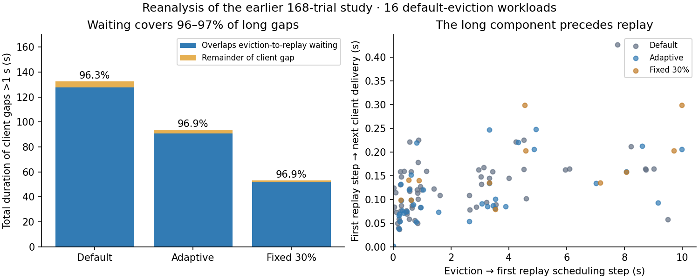
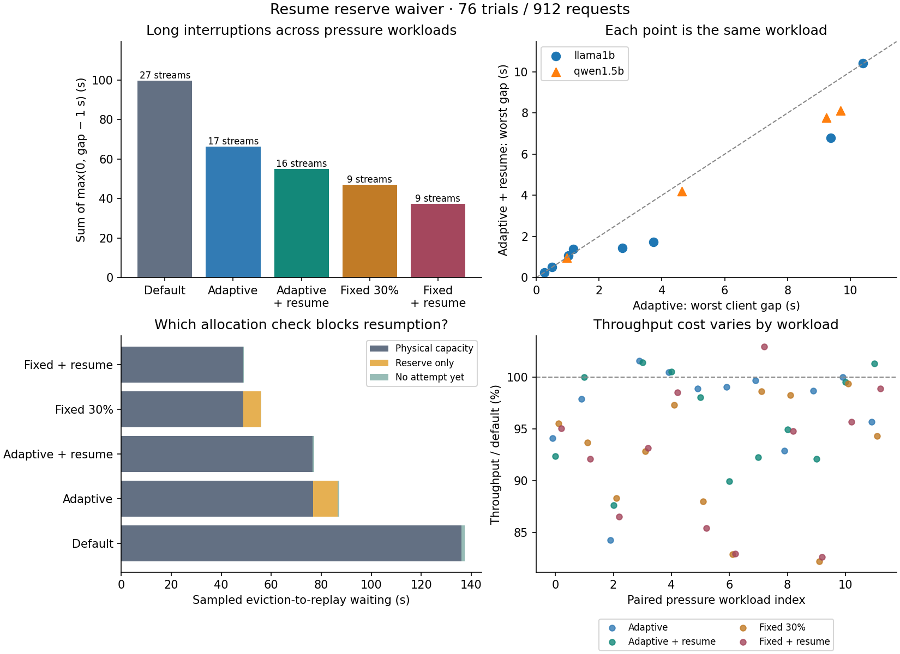

# Eviction counts versus interruption: measuring resumption delay

October 3, 2026 · RTX 4060 Laptop · vLLM 0.30.0

The targeted result is a **partial improvement, with a clear mechanism and failure boundary**. Waiving the admission reserve for preempted requests reduced excess pause time 17.4% versus the unchanged adaptive policy, at 98.9% of its throughput. Stalled streams changed 17 → 16; worst pause changed 10.397 → 10.430 seconds. Physical cache capacity remains the dominant resumption obstacle. This simple intervention does not bound silence. Across four Llama generation controls it retains 48–110% of the incremental gain over cap3, so nearly full throughput retention should not be confused with retaining the full batching benefit.

**Completed:** 76 new retained trials / 912 requests across eight server configurations, plus a fresh timing reanalysis of the previous 168 retained trials / 2,016 requests. Diagnostic trials and warmups are excluded. All native arrival orders, token counts, preemption/replay accounting, admission invariants and frozen evaluation hashes passed. See [checks](checks.json), [prospective design](DESIGN.md), and [related work](RELATED_WORK.md).

## 1. Waiting dominates the observed interruption

In the previous study's 16 default-eviction workloads, 96.3% of the **full duration of client gaps longer than one second** overlaps that same request's eviction-to-first-replay scheduling wait. The next client delivery followed the first replay scheduling step after a median 0.121 seconds (P95 0.222). Adaptive and fixed headroom showed 96.9% coverage as well. The new default pressure runs independently show 96.2% coverage, with 27 stalled streams, all themselves evicted. All 29 default streams with >1-second pauses were themselves evicted.

This is temporal attribution, not a GPU-kernel decomposition: the second interval includes dispatch, GPU execution, asynchronous output processing and client transport. Multiple waits are unioned within each request before measuring coverage, so overlapping evictions are not double-counted. Conditional per-victim medians across policies compare different victims and should not be interpreted as paired causal estimates.

The proxy counterexample is broader than one anecdote: the previous adaptive policy had **fewer evictions but a worse maximum gap in 4 of 16 pressure workloads**; fixed headroom did so in 2. A 50 ms difference is used only as a descriptive reporting filter, not statistical significance.



## 2. A controlled resumption intervention

Native vLLM already prepends preempted requests to its waiting queue. The intervention waives only the cache watermark when the native allocator considers a `PREEMPTED` request; fresh `WAITING` requests retain the same global reserve. Native physical-capacity and full-input checks, queue order, victim selection, and stale asynchronous-output handling remain active. No output-length predictor or future output oracle is supplied. Requests evicted before first delivery are eligible, too; the traces distinguish their client state.

Policies are default (zero watermark), fixed 30%, and the prior adaptive controller (.05 start, +.08 per eviction, −.02 after 128 calm nonempty steps, .45 maximum), with the latter two repeated with the resume waiver. Every trial resets controller state. Constants, matrix and evaluation code were frozen before diagnostic performance observations and were not retuned.

The matrix uses seeds 23/77 and shuffled configurations/policies: Llama 3.2 1B, 3,072 nominal KV slots/cap12, two heterogeneous length mixes and two arrival modes, all five policies (40 trials); Qwen 2.5 1.5B, 3,072/cap6, generation-heavy mix and both arrival modes, all policies (20); Llama 12,288/cap12 capacity-relief controls (12); Llama 3,072/cap3 batching controls (4). Twelve requests per workload. Clustered arrivals are spaced 50 ms; staggered arrivals add exponential spacing. Exact prompt IDs, output targets and native command lines are saved with each run.

BF16, block16, prefix caching disabled, eager asynchronous FlashInfer, maximum context and batch-token limit 2,048. Nominal cache sizes are 96/384 MiB for Llama and 84 MiB for Qwen; the allocator reserves a null block. Synthetic output lengths are forced with EOS ignored. Runtime and helper/native-source hashes are saved in [provenance](provenance.json).

## 3. Results on all 12 default-eviction workloads

Each policy has the same 144 request arrivals and targets in this subset. Throughput is generated tokens divided by workload wall time; retention is the geometric mean of paired ratios. Excess pause sums `max(0, gap − 1 s)` over all post-first-delivery gaps, whereas stalled-stream counts count each request once.

| Policy | Throughput / default | Streams with >1 s gap | Evictions | Replay positions | Excess pause (s) | Worst gap (s) |
|---|---:|---:|---:|---:|---:|---:|
| Default | 100.0% | 27/144 | 58 | 29,941 | 99.49 | 10.267 |
| Adaptive | 96.8% | 17/144 | 32 | 18,619 | 66.39 | 10.397 |
| Adaptive + resume waiver | 95.7% | 16/144 | 35 | 21,155 | 54.85 | 10.430 |
| Fixed 30% | 92.4% | 9/144 | 12 | 8,416 | 46.89 | 10.657 |
| Fixed + resume waiver | 92.2% | 9/144 | 16 | 11,349 | 37.30 | 8.071 |

The adaptive waiver has 32 → 35 evictions and 18,619 → 21,155 replay positions, despite lower aggregate excess pause. There are 6 paired workloads with a smaller worst gap, 1 with a larger one, and the rest within 50 ms. Fixed waiver reduces excess pause 20.5% at 99.7% of fixed-policy throughput, with 9 → 9 stalled streams and 12 → 16 evictions. Repeatedly evicted requests change 4 → 7 for adaptive and 0 → 4 for fixed. The balanced-length stratum regresses: excess pause rises from 0.20 to 0.45 s while throughput falls 4.3%; generation-heavy workloads show the aggregate improvement. Seed77 has no reduction in stalled-stream count. These are descriptive workload samples, not confidence bounds.

| Adaptive waiver versus adaptive, stratum | Pairs | Throughput retained | Stalled streams | Excess pause (s) |
|---|---:|---:|---:|---:|
| model=llama1b | 8 | 97.6% | 10 → 9 | 36.12 → 28.93 |
| model=qwen1.5b | 4 | 101.4% | 7 → 7 | 30.27 → 25.93 |
| mix=balanced | 4 | 95.7% | 2 → 2 | 0.20 → 0.45 |
| mix=generation | 8 | 100.5% | 15 → 14 | 66.19 → 54.40 |
| arrival=burst | 6 | 99.9% | 7 → 7 | 25.40 → 19.92 |
| arrival=stagger | 6 | 97.8% | 10 → 9 | 40.99 → 34.93 |
| seed=23 | 6 | 100.5% | 5 → 4 | 11.13 → 6.25 |
| seed=77 | 6 | 97.2% | 12 → 12 | 55.26 → 48.60 |



## 4. What actually prevents resumption?

For adaptive admission, sampled eviction-to-replay wait totals 87.18 request-seconds: 76.85 s (88.2%) follow physical-capacity refusals, 9.81 s (11.3%) follow reserve-only refusals, and 0.51 s precede the first traced attempt. The waiver produces 20 admissions that the current watermark would have refused, removes reserve-only refusals, and leaves 76.59 s of physical-capacity waiting. Fixed waiver has 12 binding admissions. An allocation check is classified using exact native full-input block requirements and free blocks.

These durations carry the last observed decision forward until the next attempt or replay step; they are sampled decision-state attribution, not a continuously observed cause or independent counterfactual. Native queue/stale-output handling can delay the first attempt. Policies can change later cache occupancy, victim choice and feedback, so removing reserve waiting does not imply an equally sized net reduction in pauses. The old study has no allocation-reason trace; its corresponding fields are null.

An illustrative continuation of the earlier counterexample—Llama seed23, generation-heavy, staggered, 3,072 slots/cap12—shows default/adaptive/resume worst gaps 2.912/3.732/1.743 s, evictions 3/2/2, and throughput 194.2/197.4/197.0 tokens/s. Adaptive's longest-wait victim (request 9) spends 2.628 s after capacity refusals and 1.006 s after watermark refusals. Resume-aware execution changes the victim trajectory; it is not a same-victim replay experiment.

## 5. Throughput retention is not batching-gain retention

Keeping nearly all high-cap throughput can still discard much of the gain over a low cap. The contemporaneous Llama generation controls measure `(policy throughput − cap3 throughput) / (default cap12 throughput − cap3 throughput)`. Fractions are reported only if default high-cap throughput exceeds cap3 by >5%; these are cross-configuration comparisons with laptop clock/run variability.

| Seed | Arrivals | Policy | Default cap12 gain over cap3 | Incremental gain retained |
|---|---|---|---:|---:|
| 23 | burst | Adaptive | 31.6% | 34.2% |
| 23 | burst | Fixed 30% | 31.6% | 51.3% |
| 23 | burst | Adaptive + resume waiver | 31.6% | 48.4% |
| 23 | burst | Fixed + resume waiver | 31.6% | 43.8% |
| 23 | stagger | Adaptive + resume waiver | 15.7% | 110.4% |
| 23 | stagger | Adaptive | 15.7% | 111.9% |
| 23 | stagger | Fixed + resume waiver | 15.7% | 49.5% |
| 23 | stagger | Fixed 30% | 15.7% | 47.1% |
| 77 | stagger | Fixed + resume waiver | 24.5% | 115.1% |
| 77 | stagger | Adaptive + resume waiver | 24.5% | 60.6% |
| 77 | stagger | Fixed 30% | 24.5% | 93.2% |
| 77 | stagger | Adaptive | 24.5% | 98.5% |
| 77 | burst | Fixed 30% | 42.3% | 94.2% |
| 77 | burst | Fixed + resume waiver | 42.3% | 82.6% |
| 77 | burst | Adaptive + resume waiver | 42.3% | 83.0% |
| 77 | burst | Adaptive | 42.3% | 76.1% |

TTFT retention here compares each trial's median first-delivery latency; completion retention compares its P95 completion latency, then geometrically averages paired ratios. Relative to adaptive, its waiver has 1.030× median TTFT and 1.015× P95 completion. Relative to default, fixed headroom has 2.212× median TTFT and 1.117× P95 completion. With just twelve requests per cell, P95 is a descriptive tail summary. The larger-cache controls have no evictions or >1 s client gaps; the files include every control result.

## 6. Replay accounting and research position

The original prompt/generation/iteration token metrics still report logical token volumes despite traced replay, and the additional `request_prefill_kv_computed_tokens_sum` also equals original prompt count in every retained trial with prefix caching disabled. Preemption counts themselves agree with the traces. This distinguishes logical usage from scheduled replay work; it is not evidence of incorrect billing or exact extra FLOPs. The detailed upstream context and narrower novelty limits are in [RELATED_WORK.md](RELATED_WORK.md).

The supported direction is an empirical characterization of **proxy mismatch and admission-to-resumption delay**, with a small ablation demonstrating both reserve-induced waiting and its limited influence when physical capacity dominates. A generic adaptive watermark or generic resume priority would overlap established work. The present waiver provides no interruption guarantee; incremental batching-gain retention varies substantially by workload. A stronger next intervention would need to address the future capacity of already-streaming requests and repeated victimization, with direct comparisons against TBT-aware systems.

## Reproduce and inspect

In the existing WSL lab, run with a fresh prefix (run directories are never overwritten):

```bash
cd ~/kv-cache-lab
source activate.sh
python experiments/resume_admission_20261003/run.py --prefix rerun
python experiments/resume_admission_20261003/analyze.py --prefix rerun
python experiments/resume_admission_20261003/analyze.py --previous
```

Analysis overwrites derived exports; copy them first to preserve this result. Figure generation uses the already installed plotting environment: `/home/varish/miniconda3/envs/kvzip/bin/python experiments/resume_admission_20261003/plot.py`. The report generator requires the complete 76-trial exports. Keep all three sibling experiment directories because helpers are reused. [results.zip](results.zip) contains this study, earlier raw studies/helpers, reports, figures and source manifests; models and runtime packages are excluded.

One GPU, two small models, two workload/order seeds, synthetic forced lengths, no tracing-overhead ablation, eager execution, and short contexts limit generalization. The timing comparison uses the same Linux/Python system-wide `perf_counter` clock, verified with bounded child-process reads in provenance; it is not a join between unrelated wall clocks. [Python documents this clock as system-wide](https://docs.python.org/3.12/library/time.html#time.perf_counter). No parameters were selected on evaluation performance. Performance is compared within this study; cross-day baseline differences are not policy effects.
